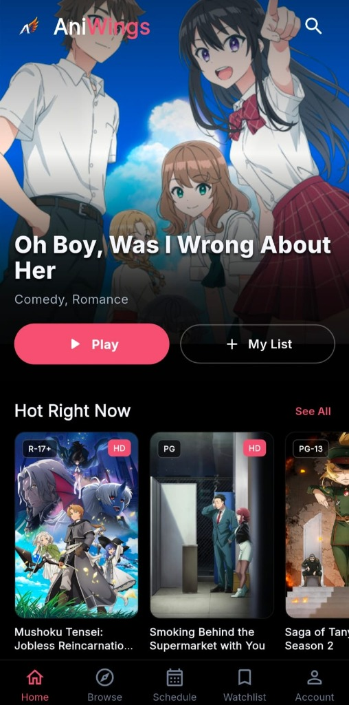
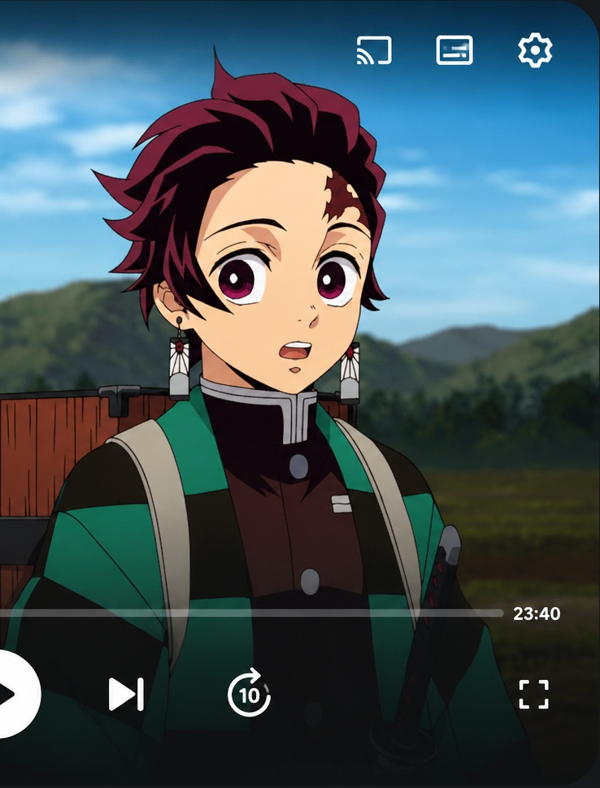

  

<h1 align="center">AniWings — Ad-Free Anime Streaming Client</h1>

  <b>Stream Thousands of Anime Episodes in HD with Zero Ads, No Sign-ups, and Dual Audio Options</b>

  
  &nbsp;
  
  &nbsp;
  

---

  
  &nbsp;
  

---

## 🌟 About AniWings

**AniWings** is a dedicated, ad-free anime client engineered for Android Mobiles, Tablets, and Smart TVs. It brings together thousands of HD anime series, movies, and current seasonal simulcasts into a clean, modern interface.

We prioritize user privacy and a seamless watching experience:
- 🚫 **No Sign-ups Required**: Watch your favorite shows instantly without creating an account or providing email addresses.
- 🛑 **Zero Ads & Pop-ups**: Experience uninterrupted playback without redirect ads or intrusive banners.
- 🔒 **100% Safe & Secure**: Operates without root access, tracking services, or background telemetry.

---

## 📥 Download & Installation Guide

| Platform | Download Link | Installation Method |
| :--- | :--- | :--- |
| **Android Mobiles & Tablets** | [**Download APK**](https://raw.githubusercontent.com/senthil-prabhu-sudo/aniwings-app/main/public/aniwings.apk) | Direct APK Installation |
| **Android TV & TV Boxes** | [**Download TV APK**](https://raw.githubusercontent.com/senthil-prabhu-sudo/aniwings-app/main/public/aniwings.apk) | Downloader App / USB Sideloading |
| **iOS (iPhone / iPad)** | *Coming Soon* | SideStore / AltStore |

---

### 📱 Installing on Android Phones & Tablets

1. **Download APK**: Tap the [**Download APK**](https://raw.githubusercontent.com/senthil-prabhu-sudo/aniwings-app/main/public/aniwings.apk) button above to save the file onto your device.
2. **Allow Installation**:
   - Open **Settings** > **Security** (or **Privacy / Apps & Notifications**).
   - Turn on **Install from Unknown Sources** for your Browser or File Manager.
3. **Install**: Open your **Downloads** folder, tap `aniwings.apk`, and press **Install**.

---

### 📺 Installing on Android TV & Smart TV Boxes

#### Method 1: Via Downloader App (Easiest)
1. Install **Downloader by AFTVnews** from the Google Play Store on your TV.
2. Open Downloader and enter the direct URL to the `.apk` file or visit `https://ani-wings.web.app`.
3. Download the TV-optimized APK and follow the prompt to install.

#### Method 2: Via USB Drive
1. Download the `aniwings.apk` file on your computer or phone.
2. Copy the file to a USB flash drive and plug it into your Android TV box.
3. Use a file manager app on your TV (such as *AnExplorer* or *File Commander*) to open the USB drive and install the file.

---

## ✨ Key Features

- 🛡️ **Ad-Free Streaming**: Pure entertainment without pop-ups, redirects, or video advertisements.
- 🗣️ **Dual Audio Toggles**: Switch effortlessly between English Subtitles (**SUB**) and English Dubbed audio (**DUB**).
- ⚡ **High-Speed CDN**: Fast streaming servers optimized to eliminate buffering and loading delays.
- 📅 **Daily Simulcasts**: Updated daily with new episodes fresh from Japanese TV broadcasts.
- ⭐ **Personal Watchlists**: Easily save your favorite anime, track watched episodes, and resume playback.
- 📺 **TV Remote Compatibility**: Fully customizable interface built specifically for Smart TV D-pad controllers.

---

## 👥 Join the Community

Stay connected for new releases, announcements, and support:

- 💬 **Discord**: [Join AniWings Discord](https://discord.com/invite/w7KwAcyPG3)
- 📢 **Telegram**: [Join AniWings Telegram](https://t.me/aniwings_off)
- 🔴 **Reddit**: [r/AniWings_Official](https://www.reddit.com/r/AniWings_Official/)
- 🌐 **Official Web App**: [ani-wings.web.app](https://ani-wings.web.app/)

---

  <i>Built with ❤️ for anime lovers worldwide.</i>

